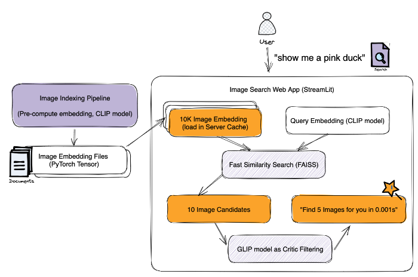

# Fast and Easy Image Search
Develope an image search application that uses multimodal foundation models to search for highly accurate and relevant results instantly.

## Installation
### General Requirements
Create a Conda environment and install the required packages:
```
conda create -n image-search python=3.10
pip install -r requirements.txt
```

Check out [PyTorch page](https://pytorch.org/get-started/locally/) for the installation guide for your system.
For example, I installed torch-1.13.1+cu116 torchaudio-0.13.1+cu116 torchvision-0.14.1+cu116 for my CUDA environment.
```
pip install torch torchvision torchaudio --extra-index-url https://download.pytorch.org/whl/cu116
```

### Install FAISS
Install faiss from conda-forge ([details](https://github.com/facebookresearch/faiss/blob/main/INSTALL.md#installing-from-conda-forge)) for 100x faster vector distance search.

```
# CPU version
conda install -c conda-forge faiss-cpu

# GPU version
conda install -c conda-forge faiss-gpu
```

### Install GLIP
We found GLIP helpful at improving the precision of image search, but it is optional. You can launch this app without intalling GLIP.
GLIP has strict requirements on the environment (e.g. PyTorch 1.9.1 and CUDA 11.1).

Pull the submodule:
```
git submodule update --init --recursive
```

Install dependencies and build the package:
```
sh .install_glip.sh
```

## Run a local app
Here is the system design of the image search app:


### Data
You can try searching with your own photos. That will be more fun! If you don’t have images to try on. I prepared a subset of ImageNet with 10,000 samples. You can download them [here](https://drive.google.com/file/d/1VfVpZ-Lrpx853WaoVtBygruOfLQGKODi/view?usp=share_link).

We manage the paths to the data directory and indexed file path in `app/constants.py`. You can change the paths to your own data directory and indexed file path.

### Launch the app
The local app is a simple web app that allows you to select a dataset and type a query to search:


Before you run the app, make sure you've prepared the dataset and set up the right path with `DATA_DIR` variable in `app/constants.py`.

You can run the local app by executing the following command:
```
sh execute.sh
```

### Optimized Implementation
Run indexer first for faster image feature retrieval:
```
python app/indexer.py
```

## Benchmarks
### Performance
We evaluated the performance of both systems using 20 image search queries. First, we generated candidate queries with ChatGPT, and then hand-picked the ones that were suitable.
We report the performance metrics of the CLIP and CLIP+GLIP systems in the table below.

| Metric               | CLIP  | CLIP+GLIP |
| -------------------- | ----- | --------- |
| Precision            | 0.567 | 0.685     |
| Mean Reciprocal Rank | 0.775 | 0.778     |
| Average Precision    | 0.639 | 0.719     |

### Latency
We conducted a benchmark study to measure the latency of image search using different implementations, hardware, and image sample sizes. The results are presented below. To ensure stable measurements, we prepared 10 search queries and ran each query three times. We then calculated the average latency required to search through the entire image set per query.

| Model            | Search Time (sec) | Image Sample Size | Device             |
| ---------------- | ----------------- | ----------------- | ------------------ |
| CLIP (OpenAI)    | 15.751            | 1000              | MacBook Pro M1 Max |
| CLIP (Optimized) | 0.035             | 1000              | MacBook Pro M1 Max |
| CLIP (OpenAI)    | 4.287             | 1000              | A4000 GPU          |
| CLIP (Optimized) | 0.005             | 1000              | A4000 GPU          |
| CLIP (Optimized) | 0.0076            | 10000             | A4000 GPU          |
| CLIP (OpenAI)    | 8.660             | 1000              | Nvidia P100        |
| CLIP (Optimized) | 0.0073            | 1000              | Nvidia P100        |
| CLIP (Optimized) | 0.0085            | 10000             | Nvidia P100        |
| GLIP             | 0.418             | 1                 | Nvidia P100        |
