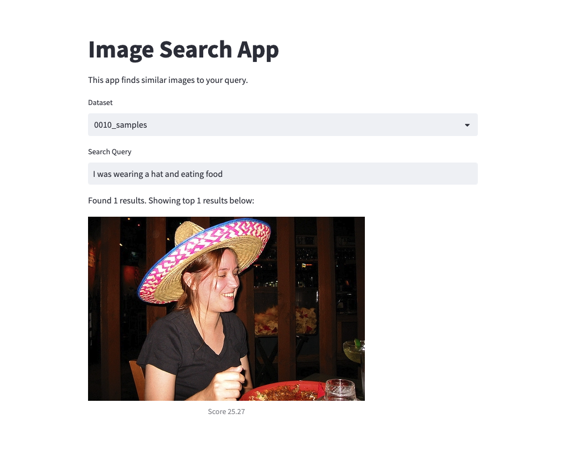

# Image Search
## Installation
Create a Conda environment and install the required packages:
```
conda create -n cs324 python=3.10
pip install -r requirements.txt
```

Check out [PyTorch page](https://pytorch.org/get-started/locally/) for the installation guide for your system.
For example, I installed torch-1.13.1+cu116 torchaudio-0.13.1+cu116 torchvision-0.14.1+cu116 for my CUDA environment.
```
pip install torch torchvision torchaudio --extra-index-url https://download.pytorch.org/whl/cu116
```

## Run a local app
The local app is a simple web app that allows you to select a dataset and type a query to search:



Before you run the app, make sure you've prepared the dataset and set up the right path with `DATA_DIR` variable in `app/search_app.py`.

You can run the local app by executing the following command:
```
sh execute.sh
```
